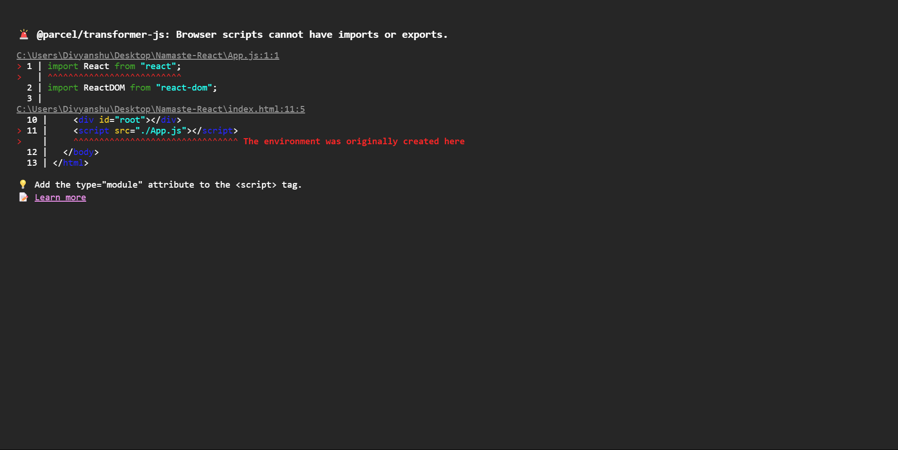

# Project Setup and Understanding npm Concepts

## Initializing a Node.js Project

### `npm init`

The `npm init` command is used to initialize a new Node.js project by creating a `package.json` file. This file serves as the project's metadata, including details like name, version, description, entry point, scripts, dependencies, and more.

Running `npm init` will prompt you to provide details manually. If you want to initialize with default values, use:

```sh
npm init -y
```

This automatically generates a `package.json` file with default settings.

## Understanding `package.json`

The `package.json` file is the core configuration file in a Node.js project. It includes:

- **Name**: Project name
- **Version**: Current version of the project
- **Description**: Short description of the project
- **Main**: Entry point file (e.g., `index.js or App.js`)
- **Scripts**: Custom commands to run scripts (e.g., `npm start`)
- **Dependencies**: List of required packages
- **DevDependencies**: Packages needed only for development

### Tilde (~) and Caret (^) Signs in `package.json`

- **Tilde (~)**: Allows patch updates only (e.g., `~1.2.3` allows updates to `1.2.x`, but not `1.3.0`)
- **Caret (^)**: Allows minor updates (e.g., `^1.2.3` allows updates up to `1.x.x`, but not `2.0.0`)

## Installing and Configuring Parcel

### `npm i -D parcel`

Parcel is a fast, zero-config bundler used for JavaScript applications. The `-D` flag (short for `--save-dev`) installs Parcel as a development dependency.

```sh
npm i -D parcel
```

This means Parcel is only required during development and will not be included in the production build.

## Understanding `package-lock.json`

### Importance of `package-lock.json`

- Ensures that all developers working on the project use the same package versions.
- Records the exact version of installed dependencies.
- Helps maintain consistency across different environments.
- Improves security by preventing accidental upgrades to incompatible versions.

## Node Modules

The `node_modules` folder contains all installed dependencies. This directory should not be modified manually, as it is managed by npm.

**Important:**

- `node_modules` can grow large, so it is generally excluded from version control (via `.gitignore`).
- To regenerate `node_modules`, simply run `npm install` using the `package.json` and `package-lock.json` files.

## Running the Project with Parcel

### `npx parcel index.html`

The `npx` command runs binaries from `node_modules` without globally installing them. To start the development server:

```sh
npx parcel index.html
```

Parcel will:

- Automatically detect dependencies.
- Start a local server for development.
- Enable hot module replacement (HMR).
- Optimize assets for production when built.

## Injecting React in a Node.js Project

### CDN vs. npm Installation

Injecting React via CDN links (such as `<script src="https://unpkg.com/react@17/umd/react.development.js"></script>`) is **not recommended** for production applications. Reasons:

- **Performance**: Not optimized for modular JavaScript applications.
- **Scalability**: Harder to manage dependencies across a project.
- **Security**: Less control over package integrity.

### Installing React via npm

To properly install React within a Node.js environment, run:

```sh
npm i react
npm i react-dom
```

This installs React (`react`) and React's DOM package (`react-dom`) into the `node_modules` directory. This approach ensures:

- Better module bundling (e.g., with Webpack, Parcel, Vite, etc.).
- Full support for JSX and component-based architecture.
- Optimized builds for production.

## Configuring ES6 Modules

To use ES6 modules in your project, update your HTML script tags to include `type="module"`:

```html
<script type="module" src="./index.js"></script>
```

This informs the browser to treat the script as a module, enabling the use of `import` and `export` statements. [Learn more about ES6 modules.](https://developer.mozilla.org/en-US/docs/Web/JavaScript/Guide/Modules)

### Common Error When ES6 Modules Are Not Configured



If you do not add `type="module"` to your script tag, you may encounter an error similar to the one below:

```
@parcel/transformer-js: Browser scripts cannot have imports or exports.
```

This happens because modern JavaScript modules require explicit declaration. The error typically occurs when you import React or any other module in your JavaScript file but do not define the script as a module in your HTML file.

To fix this, ensure that your script tag in `index.html` looks like this:

```html
<script type="module" src="./App.js"></script>
```

## Parcel Features

Parcel offers a range of features to enhance development and production workflows:

- **Development Build**: Quickly compiles code for development purposes.
- **Local Server**: Starts a local server for testing and development.
- **Hot Module Replacement (HMR)**: Automatically updates modules in the browser without a full reload.
- **File Watching Algorithm**: Monitors files for changes to trigger automatic rebuilds.
- **Caching**: Speeds up builds by caching unchanged files.
- **Bundling**: Combines multiple files into optimized bundles.
- **Image Optimization**: Compresses images for faster load times.
- **Consistent Hashing**: Generates consistent filenames for caching purposes.
- **Code Splitting**: Breaks code into smaller chunks for improved load times.
- **Differential Bundling**: Creates bundles optimized for different environments (e.g., modern vs. legacy browsers).
- **Error Handling and Diagnostics**: Provides clear error messages and debugging information.
- **Tree Shaking**: Removes unused code to reduce bundle size.
- **Minification**: Compresses code to minimize file sizes.
- **Production Builds**: Generates optimized bundles for deployment.

For a comprehensive list of features, visit the [official Parcel documentation](https://parceljs.org/features/).

    ### Configuring Package.json for Easier Commands

Instead of running `npx parcel index.html` for development and `npx parcel build index.html` for production every time, we can configure our `package.json` file to simplify this process:

```json
"scripts": {
    "start": "parcel index.html",
    "build": "parcel build index.html"
}
```

Now, you can start the development server with:

```sh
npm run start
```

And create a production build with:

```sh
npm run build
```

This makes running Parcel much more efficient and avoids repetitive commands.

# Babel: The JavaScript Compiler

Babel is a free and open-source JavaScript compiler and toolchain that enables developers to write code using the latest JavaScript features, even if those features are not yet supported by all browsers or JavaScript environments. It compiles the code into backward-compatible JavaScript, allowing developers to adopt new features without worrying about browser compatibility. :contentReference[oaicite:0]{index=0}

## Key Features

1. **JavaScript Syntax Transformation**:

   - **ES6+ to ES5 Conversion**: Babel transforms modern JavaScript syntax (ES6 and newer) into ES5 syntax, ensuring compatibility across various browsers. For example, it converts arrow functions into traditional function expressions. :contentReference[oaicite:1]{index=1}

2. **JSX Transformation in React**:

   - **Role of Babel**: Babel converts JSX syntax into standard JavaScript function calls that browsers can interpret.
   - **Transformation Process**:
     - **Parsing**: Babel parses the JSX code into an Abstract Syntax Tree (AST), representing the code's structure.
     - **Transformation**: The AST is processed, converting JSX elements into `React.createElement` function calls.
     - **Code Generation**: The transformed AST is then converted back into JavaScript code.
   - **Example**:
     - **JSX Code**: `<h1 className="title">Hello, World!</h1>`
     - **Transformed Code**: `React.createElement('h1', { className: 'title' }, 'Hello, World!');`
   - **Automatic Runtime**: With the introduction of React 17 and Babel 7.9.0, there's no longer a need to import React explicitly in files using JSX. Babel automatically handles the transformation, reducing boilerplate and potential errors.

3. **Plugins and Presets**:

   - **@babel/preset-react**: A preset that includes plugins necessary for transforming JSX and other React-specific syntax into JavaScript.
   - **@babel/plugin-transform-react-jsx**: A plugin specifically designed to transform JSX syntax into `React.createElement` calls.
   - **Customization**:
     - **`pragma` Option**: Allows customization of the function used when compiling JSX expressions. Defaults to `React.createElement`.
     - **`pragmaFrag` Option**: Specifies the component used for fragments. Defaults to `React.Fragment`.
     - **`importSource` Option**: In React's automatic runtime, this option replaces the import source when importing functions. Defaults to `react`.

4. **Polyfills**:

   - **Core-js Integration**: Babel can integrate with libraries like core-js to polyfill features missing in target environments, ensuring that new JavaScript functionalities work in older browsers. :contentReference[oaicite:2]{index=2}

5. **Source Code Transformations**:

   - **Codemods**: Babel can be used for source code transformations, such as codemods, to automate code refactoring tasks. :contentReference[oaicite:3]{index=3}

6. **TypeScript Support**:

   - **TypeScript Compilation**: Babel can parse and transform TypeScript syntax, allowing developers to use TypeScript features without setting up a separate TypeScript compiler. :contentReference[oaicite:4]{index=4}

7. **Plugin Ecosystem**:

   - **Syntax Plugins**: Babel offers plugins like `@babel/plugin-syntax-bigint` to enable parsing of specific syntax types.
   - **Transform Plugins**: Plugins such as `@babel/plugin-transform-arrow-functions` transform specific syntax features into compatible versions.

8. **Configuration Options**:

   - **.babelrc**: A configuration file that allows developers to specify presets and plugins for Babel to use during the transformation process.
   - **babel.config.js**: An alternative configuration file format that can be used for more complex configurations. :contentReference[oaicite:5]{index=5}

9. **Integration with Build Tools**:

   - **Webpack**: Babel integrates seamlessly with bundlers like Webpack using loaders such as `babel-loader`, enabling the transformation of JavaScript and JSX files during the build process.

10. **Performance Optimizations**:
    - **Selective Polyfilling**: With options like `useBuiltIns: 'usage'` in `@babel/preset-env`, Babel can include only the necessary polyfills based on the code usage and target environments, optimizing bundle sizes.

By leveraging these features, Babel empowers developers to write modern, efficient, and maintainable JavaScript and JSX code, ensuring compatibility across diverse environments and enhancing the overall development experience.

<existing README content>

### Conclusion

By following these steps, you've set up a Node.js project with React and Parcel, configured ES6 modules, and leveraged Parcel's robust features for an efficient development workflow.

# JSX vs HTML vs XML - Detailed Comparison

## Overview

JSX (JavaScript XML) is a syntax extension for JavaScript, primarily used with React to describe user interfaces. While it resembles HTML and shares some similarities with XML, there are distinct differences between these technologies. Below is a detailed comparison to elucidate these differences.

## Comparison Table

| **Aspect**                      | **JSX**                                                                                                                                                                                                                                       | **HTML**                                                                                                                                                                             | **XML**                                                                                                                                                                     |
| ------------------------------- | --------------------------------------------------------------------------------------------------------------------------------------------------------------------------------------------------------------------------------------------- | ------------------------------------------------------------------------------------------------------------------------------------------------------------------------------------ | --------------------------------------------------------------------------------------------------------------------------------------------------------------------------- |
| **Definition**                  | A syntax extension for JavaScript that allows writing HTML-like code within JavaScript.                                                                                                                                                       | The standard markup language for creating web pages and web applications.                                                                                                            | A markup language that defines rules for encoding documents in a format readable by both humans and machines.                                                               |
| **Purpose**                     | Facilitates the creation of dynamic and interactive user interfaces in JavaScript applications, especially with React.                                                                                                                        | Structures content on the web, defining elements like headings, paragraphs, links, and images.                                                                                       | Encodes data in a structured format, often used for data storage and transport.                                                                                             |
| **Integration with JavaScript** | Allows embedding JavaScript expressions directly within the markup using curly braces `{}`. Example: `<h1>{title}</h1>`                                                                                                                       | Requires separate `<script>` tags to include JavaScript; cannot embed JavaScript expressions directly within tags.                                                                   | Does not support JavaScript integration and focuses solely on data representation.                                                                                          |
| **Syntax Rules**                | - Tags must be properly closed, even self-closing ones like `<br />`. - Uses `className` instead of `class` due to `class` being a reserved keyword in JavaScript. - Attributes and event handlers are written in camelCase, e.g., `onClick`. | - Self-closing tags can omit the closing slash, e.g., `<br>`. - Uses `class` attribute for CSS classes. - Attributes and event handlers are typically in lowercase, e.g., `onclick`. | - All tags must be properly closed. - Attribute names are case-sensitive. - They do not define specific attributes; they are user-defined based on the application's needs. |
| **Error Handling**              | Errors in JSX compilation will prevent the application from running, promoting early error detection.                                                                                                                                         | Browsers often handle minor HTML errors gracefully, attempting to render the page despite issues.                                                                                    | Strict syntax rules; errors will prevent the document from being parsed correctly.                                                                                          |
| **Usage Context**               | Used within JavaScript files to define UI components in frameworks like React.                                                                                                                                                                | Used in HTML files to structure web content and is directly rendered by browsers.                                                                                                    | Used in various contexts where structured data representation is needed, such as configuration files and data interchange between systems.                                  |
| **Self-Closing Tags**           | Requires explicit closing of self-closing tags, e.g., ``.                                                                                                                                                              | Self-closing tags can omit the closing slash, e.g., ``.                                                                                                         | All tags, including self-closing ones, must be properly closed.                                                                                                             |
| **Attribute Naming**            | Uses camelCase for attribute names, e.g., `tabIndex`, `readOnly`.                                                                                                                                                                             | Uses lowercase for attribute names, e.g., `tabindex`, `readonly`.                                                                                                                    | Attribute naming conventions are user-defined but are case-sensitive.                                                                                                       |
| **Comments**                    | Uses `{/* Comment */}` for comments within JSX code.                                                                                                                                                                                          | Uses `<!-- Comment -->` for comments.                                                                                                                                                | Uses `<!-- Comment -->` for comments.                                                                                                                                       |
| **Namespaces**                  | Does not support XML namespaces.                                                                                                                                                                                                              | Does not support XML namespaces.                                                                                                                                                     | Supports namespaces to avoid element name conflicts.                                                                                                                        |
| **Data Binding**                | Supports data binding by allowing JavaScript expressions within the markup.                                                                                                                                                                   | Does not support data binding within the markup and requires JavaScript for dynamic content.                                                                                         | Does not support data binding; it is used for data representation.                                                                                                          |
| **Parsing Requirements**        | Requires transpilation (e.g., using Babel) to convert JSX into standard JavaScript before execution in the browser.                                                                                                                           | Directly parsed and rendered by web browsers without additional processing.                                                                                                          | Requires an XML parser to read and manipulate the data.                                                                                                                     |
| **Flexibility**                 | Allows custom components to be created and embedded within the markup.                                                                                                                                                                        | Limited to predefined HTML tags; custom elements require additional definitions like Web Components.                                                                                 | Highly flexible; users define their own tags and structure based on the application's needs.                                                                                |

## Conclusion

Understanding these distinctions is crucial for developers working with web technologies, as it influences how they structure their code, integrate functionality, and ensure compatibility across different platforms.

# Understanding React Elements and Components

In React, **elements** and **components** are fundamental building blocks used to construct user interfaces. Understanding their differences and roles is crucial for developing efficient and maintainable React applications.

## React Elements

A **React element** is an immutable description of what you want to see on the screen. It is a plain object representing a DOM node or another component. Elements are the smallest building blocks of React apps and are typically created using JSX syntax or the `React.createElement` function. Once created, they cannot be changed. citeturn0search11

**Example using JSX:**

```jsx
const element = <h1>Hello, world!</h1>;
```

**Example without JSX:**

```jsx
const element = React.createElement("h1", null, "Hello, world!");
```

## React Components

A **React component** is a reusable, self-contained piece of code that defines how a portion of the UI should appear and behave. Components can be declared as JavaScript functions or classes and can manage their own state and lifecycle methods. They accept inputs, known as "props," and return React elements that describe what should appear on the screen. citeturn0search2

**Functional Component Example:**

```jsx
function Welcome(props) {
  return <h1>Hello, {props.name}</h1>;
}
```

**Class Component Example:**

```jsx
class Welcome extends React.Component {
  render() {
    return <h1>Hello, {this.props.name}</h1>;
  }
}
```

## Key Differences

- **Purpose:** Elements are the basic units that describe the structure of the UI, whereas components are constructs that encapsulate logic and state to produce those elements.

- **Mutability:** Elements are immutable and cannot be changed once created. Components, on the other hand, can manage and update their internal state over time.

- **Usage:** Elements are typically returned by components to define the UI structure, while components are used to encapsulate behavior and can be composed together to build complex UIs.

Understanding these distinctions is crucial for effectively designing and organizing React applications.

# Understanding React Components: Functional vs. Class-Based

In React, components are the fundamental building blocks used to create user interfaces. They come in two primary types: **functional components** and **class-based components**. Understanding their differences, use cases, and respective advantages and disadvantages is essential for effective React development.

## Functional Components

Functional components are JavaScript functions that accept props (inputs) and return JSX, which describes what should appear on the screen. They are typically used for rendering UI elements and became more powerful with the introduction of React Hooks in version 16.8, enabling them to manage state and side effects.

**Example:**

```jsx
import React, { useState } from "react";

function Counter() {
  const [count, setCount] = useState(0);

  return (
    <div>
      <p>You clicked {count} times</p>
      <button onClick={() => setCount(count + 1)}>Click me</button>
    </div>
  );
}
```

**Pros of Functional Components:**

- **Simplicity and Readability:** They are generally easier to read and write, leading to cleaner and more maintainable code.

- **Performance:** Functional components may offer better performance due to the absence of the overhead associated with class components.

- **Hooks Integration:** With Hooks, functional components can handle state and lifecycle methods, providing a more concise syntax.

**Cons of Functional Components:**

- **Learning Curve:** Developers need to understand Hooks to manage state and lifecycle events effectively.

## Class-Based Components

Class-based components are ES6 classes that extend from `React.Component`. They have access to lifecycle methods and can maintain their own state, making them suitable for complex components that require extensive logic.

**Example:**

```jsx
import React, { Component } from "react";

class Counter extends Component {
  constructor(props) {
    super(props);
    this.state = { count: 0 };
  }

  incrementCount = () => {
    this.setState({ count: this.state.count + 1 });
  };

  render() {
    return (
      <div>
        <p>You clicked {this.state.count} times</p>
        <button onClick={this.incrementCount}>Click me</button>
      </div>
    );
  }
}
```

**Pros of Class-Based Components:**

- **Lifecycle Methods:** They provide built-in lifecycle methods, offering fine-grained control over component behavior during different stages.

- **Error Boundaries:** Class components can serve as error boundaries, catching JavaScript errors anywhere in their child component tree.

**Cons of Class-Based Components:**

- **Verbosity:** They tend to be more verbose, requiring additional boilerplate code, which can make the codebase harder to manage.

- **Performance:** Class components may have a slight performance overhead compared to functional components.

## Key Differences

- **Syntax:** Functional components are plain JavaScript functions, whereas class components are ES6 classes extending `React.Component`.

- **State and Lifecycle Management:** Initially, only class components could manage state and lifecycle events, but with Hooks, functional components have gained these capabilities.

- **`this` Keyword:** Class components use the `this` keyword to access props and state, which can lead to confusion, especially with incorrect bindings. Functional components do not use `this`, reducing complexity.

## Use Cases

- **Functional Components:** Ideal for components that are primarily presentational and do not require extensive state management or lifecycle methods. With Hooks, they are now suitable for most scenarios.

- **Class-Based Components:** Useful in legacy codebases or when implementing error boundaries, as they can catch errors in their child component tree.

In modern React development, functional components with Hooks are generally preferred due to their simplicity and flexibility. However, understanding class-based components remains important, especially when working with older codebases or specific scenarios requiring their features.

_Note: The information provided here is based on general React development practices and may not reflect the most current updates. For the latest information, refer to the official React documentation._

# Understanding Regular Functions vs. Arrow Functions in JavaScript

In JavaScript, functions can be defined using two primary syntaxes: **regular functions** and **arrow functions**. Introduced in ECMAScript 6 (ES6), arrow functions offer a concise syntax but come with distinct behaviors compared to regular functions. This guide explores their differences, advantages, and appropriate use cases.

## Table of Contents

1. [Syntax Differences](#1-syntax-differences)
2. [`this` Binding](#2-this-binding)
3. [Arguments Object](#3-arguments-object)
4. [Constructor Usage](#4-constructor-usage)
5. [Function Hoisting](#5-function-hoisting)
6. [Duplicate Parameter Names](#6-duplicate-parameter-names)
7. [Use Cases](#7-use-cases)
8. [Summary](#8-summary)

## 1. Syntax Differences

- **Regular Functions:** Defined using the `function` keyword.

```javascript
function add(a, b) {
  return a + b;
}
```

- **Arrow Functions:** Utilize the `=>` syntax, offering a shorter form.

```javascript
const add = (a, b) => a + b;
```

Arrow functions provide a more concise syntax, especially beneficial for simple one-liners. citeturn0search2

## 2. `this` Binding

- **Regular Functions:** The value of `this` depends on the calling context and can change based on how the function is invoked.

```javascript
const person = {
  name: "Alice",
  greet: function () {
    console.log(this.name);
  },
};
person.greet(); // Outputs: Alice
```

- **Arrow Functions:** `this` is lexically inherited from the surrounding scope where the function is defined, meaning it doesn't change based on the invocation context.

```javascript
const person = {
  name: "Alice",
  greet: () => {
    console.log(this.name);
  },
};
person.greet(); // Outputs: undefined
```

In the arrow function example, `this` doesn't refer to the `person` object, leading to `undefined`. citeturn0search3

## 3. Arguments Object

- **Regular Functions:** Have access to the `arguments` object, an array-like collection of all arguments passed to the function.

```javascript
function showArgs() {
  console.log(arguments);
}
showArgs(1, 2, 3); // Outputs: [1, 2, 3]
```

- **Arrow Functions:** Do not have their own `arguments` object; attempting to access it will refer to the outer scope's `arguments` or result in an error if none exists.

```javascript
const showArgs = () => {
  console.log(arguments);
};
showArgs(1, 2, 3); // ReferenceError: arguments is not defined
```

To handle arguments in arrow functions, you can use rest parameters:

```javascript
const showArgs = (...args) => {
  console.log(args);
};
showArgs(1, 2, 3); // Outputs: [1, 2, 3]
```

Arrow functions do not have their own `arguments` object but can achieve similar functionality using rest parameters. citeturn0search2

## 4. Constructor Usage

- **Regular Functions:** Can be used as constructors with the `new` keyword to create instances.

```javascript
function Person(name) {
  this.name = name;
}
const alice = new Person("Alice");
console.log(alice.name); // Outputs: Alice
```

- **Arrow Functions:** Cannot be used as constructors; attempting to do so will throw an error.

```javascript
const Person = (name) => {
  this.name = name;
};
const alice = new Person("Alice"); // TypeError: Person is not a constructor
```

Arrow functions lack a `prototype` property, making them unsuitable for use as constructors. citeturn0search1

## 5. Function Hoisting

- **Function Declarations (Regular Functions):** Are hoisted, meaning they can be called before their declaration.

```javascript
sayHello(); // Outputs: Hello!

function sayHello() {
  console.log("Hello!");
}
```

- **Function Expressions and Arrow Functions:** Are not hoisted in the same way. Calling them before declaration results in an error.

```javascript
sayHello(); // TypeError: sayHello is not a function

const sayHello = () => {
  console.log("Hello!");
};
```

Function declarations are hoisted, allowing them to be invoked prior to their definition. citeturn0search2

## 6. Duplicate Parameter Names

- **Regular Functions:** In non-strict mode, they allow duplicate parameter names, though it's discouraged.

```javascript
function sum(a, a) {
  return a + a;
}
console.log(sum(2, 3)); // Outputs: 6
```

- **Arrow Functions:** Do not allow duplicate parameter names.

```javascript
const sum = (a, a) => a + a; // SyntaxError: Duplicate parameter name not allowed in this context
```

Arrow functions enforce unique parameter names, aligning with strict mode conventions. citeturn0search2

## 7. Use Cases

- **Regular Functions:** Suitable when dynamic

# Cross-Site Scripting (XSS) in JSX & How React Helps Prevent It

## Introduction

Cross-site scripting (XSS) is a security vulnerability that allows attackers to inject malicious scripts into web applications. This can lead to session hijacking, data theft, or unauthorized actions on behalf of users. React provides built-in protection against XSS attacks, but developers must still follow best practices to ensure security.

---

## What is XSS in JSX?

JSX (JavaScript XML) is a syntax extension for JavaScript used in React to create UI components. If user-generated content is not handled properly, it can introduce XSS vulnerabilities.

### **Example of an XSS Vulnerability in JSX:**

```jsx
const userInput = "<script>alert('Hacked!');</script>";
return <div>{userInput}</div>; // Vulnerable to XSS
```

**Risk:** If `userInput` comes from an untrusted source (like user input or API response), the script inside will execute when the component renders, leading to an XSS attack.

---

## How React Prevents XSS

React automatically **escapes** all values inside JSX expressions, converting special characters into their HTML entity equivalents, preventing script execution.

### **Example of React’s Default XSS Protection:**

```jsx
const userInput = "<script>alert('Hacked!');</script>";
return <div>{userInput}</div>;
```

#### **Rendered Output (Safe):**

```html
<div>&lt;script&gt;alert('Hacked!');&lt;/script&gt;</div>
```

Since React escapes content before rendering, `<script>` tags do not execute, preventing XSS.

---

## When Can XSS Still Occur in React?

XSS vulnerabilities can still occur in React applications if **dangerouslySetInnerHTML** is used without proper sanitization.

### **Example of an XSS Vulnerability in React:**

```jsx
const userInput = "<script>alert('Hacked!');</script>";
return <div dangerouslySetInnerHTML={{ __html: userInput }} />;
```

#### **Risk:** This will execute the `<script>` tag, leading to an XSS attack.

---

## Best Practices to Prevent XSS in React

### \*\*1. Avoid Using \*\*\`\`

If possible, avoid using `dangerouslySetInnerHTML`. If necessary, ensure proper sanitization.

### **2. Sanitize User Input Using Libraries**

Use libraries like `DOMPurify` to sanitize HTML before rendering.

```jsx
import DOMPurify from "dompurify";

const safeHTML = DOMPurify.sanitize(userInput);
return <div dangerouslySetInnerHTML={{ __html: safeHTML }} />;
```

### **3. Use React’s Default Escaping Mechanism**

React automatically escapes JSX expressions. Always insert dynamic content inside JSX like this:

```jsx
return <div>{userInput}</div>; // Safe
```

### **4. Implement Content Security Policy (CSP)**

Configure CSP headers to block inline scripts and restrict resource loading.

### **5. Validate and Sanitize User Input on Backend**

Ensure input validation and sanitization are enforced on both the front end and backend to prevent malicious data entry.

---

## Conclusion

React provides built-in protection against XSS by escaping user-generated content in JSX. However, developers must avoid using `dangerouslySetInnerHTML` or properly sanitize content when necessary. Following security best practices ensures that React applications remain secure from XSS vulnerabilities.

---

### **References**

- [React Docs - JSX Security](https://reactjs.org/docs/introducing-jsx.html#jsx-prevents-injection-attacks)
- [MDN - Cross-Site Scripting (XSS)](https://developer.mozilla.org/en-US/docs/Glossary/Cross-site_scripting)

# **Planning & Structuring a React Application - A Case Study on Food Ordering Apps**

## **📌 Overview**

The **Food Ordering App** is a conceptual design for an online food delivery platform, inspired by **Zomato** and **Swiggy**. This README outlines the **UI planning, wireframe creation, and application structure** before implementing it in React.

---

## **🚀 UI Design Planning**

### **1️⃣ Research & Define Requirements**

Before starting UI design, it's important to define the following:

#### **🔹 Target Audience**

- Food lovers
- Working professionals
- College students
- Families looking for quick meal options

#### **🔹 Core Features & Functionalities**

1. **User Authentication**
   - Signup / Login (Email & Password)
   - Social Logins (Google, Facebook, GitHub)
   - OTP Verification for secure access
2. **Restaurant Discovery**
   - Search & Filters (Cuisine, Ratings, Distance, Offers)
   - Featured Restaurants & Promotions
   - User Reviews & Ratings
3. **Menu Selection & Ordering**
   - View complete menu with descriptions & images
   - Add/remove items from the cart
   - Customize orders (extra toppings, spice level, etc.)
4. **Ordering & Checkout**
   - Address selection & delivery instructions
   - Payment options (UPI, Card, COD)
   - Apply discount coupons & offers
5. **Order Tracking & Notifications**
   - Live order tracking with estimated time
   - Delivery personnel contact details
   - Push notifications & SMS updates
6. **User Profile & Order History**
   - View previous orders
   - Reorder favorite meals
   - Manage addresses & payment methods

---

## **📝 Wireframe Creation**

A wireframe is a **visual representation** of the app layout. Below are the key screens with their structures.

### **📌 1. Login & Signup Page**

```
----------------------------------------
|  🍕 Food Ordering App Logo          |
----------------------------------------
|  [ Email Input Field ]              |
|  [ Password Input Field ]           |
|  [ Login Button ]                   |
|  [ Sign Up Button ]                 |
|  (or) Login with [Google] [Facebook]|
----------------------------------------
```

### **📌 2. Home Page (Restaurant Discovery)**

```
------------------------------------------------
| 🔍 [ Search Bar ]        🏠 Profile Icon    |
------------------------------------------------
| 🍔 Trending Now       | 🍕 Offers & Discounts |
------------------------------------------------
| 🏠 Restaurant 1  ⭐⭐⭐⭐ (4.5)  30 mins |
|    Cuisine: Indian | Order Now |
------------------------------------------------
| 🏠 Restaurant 2  ⭐⭐⭐ (3.9)  45 mins |
|    Cuisine: Chinese | Order Now |
------------------------------------------------
```

### **📌 3. Restaurant Page (Menu & Details)**

```
-------------------------------------------------
| 🏠 Restaurant Name  ⭐⭐⭐⭐ (4.5) |
|  Delivery Time: 30 mins | Open Now |
-------------------------------------------------
| 🍕 Menu Section |
-------------------------------------------------
|  🍔 Burger  ₹200  [ + Add to Cart ] |
|  🍕 Pizza  ₹350  [ + Add to Cart ] |
|  🍝 Pasta  ₹250  [ + Add to Cart ] |
-------------------------------------------------
```

### **📌 4. Cart Page**

```
-------------------------------------------------
| 🛒 Your Cart (3 items)                        |
-------------------------------------------------
| 🍔 Burger   x1   ₹200  [ - 1 + ]  ❌ Remove |
| 🍕 Pizza    x2   ₹700  [ - 2 + ]  ❌ Remove |
-------------------------------------------------
| 🏠 Delivery Address:  [ Change Address ]     |
-------------------------------------------------
| Total: ₹900      [ Proceed to Checkout ]     |
-------------------------------------------------
```

### **📌 5. Checkout Page**

```
-------------------------------------------------
| Payment Methods                               |
-------------------------------------------------
| 🔘 UPI  (Google Pay, PhonePe, Paytm)         |
| 🔘 Debit/Credit Card                         |
| 🔘 Cash on Delivery                          |
-------------------------------------------------
|  Apply Coupon [________]   [ Apply ]         |
-------------------------------------------------
| [ Confirm & Pay ]                            |
-------------------------------------------------
```

### **📌 6. Order Tracking Page**

```
-------------------------------------------------
| Order Status: ✅ Placed → 🍳 Cooking → 🚴 On the Way |
-------------------------------------------------
| Estimated Time: 30 mins                       |
| 🏍️ Delivery Person: Ramesh | Call 📞          |
| 📍 Live Location: [ Google Maps Integration ] |
-------------------------------------------------
```

---

## **📂 Project Folder Structure**

```
food-ordering-app/
│── public/
│── src/
│   │── assets/               # Images, Icons, Static files
│   │── components/           # Reusable UI Components
│   │── pages/                # All screens/pages
│   │   │── HomePage.js       # Home Page Component
│   │   │── RestaurantPage.js # Restaurant Details & Menu
│   │   │── CartPage.js       # Cart Page
│   │   │── CheckoutPage.js   # Checkout & Payment
│   │   │── OrderTracking.js  # Live Order Tracking
│   │   │── UserProfile.js    # Profile & Order History
│   │── hooks/                # Custom Hooks
│   │── context/              # State Management (Context API / Redux)
│   │── services/             # API Calls (Fetch, Axios)
│   │── utils/                # Utility Functions
│   │── App.js                # Main App Component
│   │── index.js              # Entry Point
│── package.json
│── README.md
```

📌 **Key Features of this Structure**:

- **`components/`** → Reusable UI elements
- **`pages/`** → Contains individual screens
- **`context/`** → Manages global state (Redux / Context API)
- **`services/`** → Handles API calls
- **`hooks/`** → Custom React hooks

---

## **🎨 UI/UX Design Considerations**

✅ **Responsive Design** (Mobile-first approach using Tailwind CSS / Material UI)\
✅ **Dark Mode Support**\
✅ **Minimalistic & Clean UI**\
✅ **Fast & Interactive Animations**\
✅ **Performance Optimization** (Lazy loading, caching, efficient state management)

---

## **🛠 Tech Stack Suggestions**

- **Frontend**: React.js, Tailwind CSS / Material UI
- **State Management**: Context API / Redux
- **Backend**: Node.js with Express.js (Optional)
- **Database**: MongoDB / Firebase (Optional)
- **Authentication**: Firebase / Auth0 / OAuth (Google, Facebook, GitHub)

---

## **📌 Conclusion**

This README provides a detailed **UI planning, wireframe structure, and project setup** before implementing it in React. The next steps involve:

1. **Creating high-fidelity mockups** in Figma / Adobe XD
2. **Implementing UI components** in React
3. **Adding state management and backend integration**

## 📸 Wireframe Preview


# React Props Guide

## Overview

In React, **props** (short for "properties") are read-only attributes used to pass data from one component to another, typically from a parent component to its child. They enable components to be dynamic and reusable by allowing them to render different outputs based on the data received.

---

## Using Props in a React Project

### 1. Passing Props from Parent to Child

Props are passed as attributes when rendering a child component within a parent component.

#### Example:

```jsx
function ChildComponent(props) {
  return <h1>Hello, {props.name}!</h1>;
}

function ParentComponent() {
  return <ChildComponent name="John" />;
}

export default ParentComponent;
```

In this example, `ParentComponent` passes the `name` prop with the value "John" to `ChildComponent`, which then renders "Hello, John!".

---

### 2. Accessing Props in Functional Components

Functional components receive props as an argument.

#### Example:

```jsx
function Greeting({ name }) {
  return <h1>Welcome, {name}!</h1>;
}

function App() {
  return <Greeting name="Alice" />;
}

export default App;
```

Here, the `Greeting` component destructures the `name` prop directly in its parameter list for cleaner syntax.

---

### 3. Accessing Props in Class Components

In class components, props are accessed via `this.props`.

#### Example:

```jsx
import React, { Component } from "react";

class Welcome extends Component {
  render() {
    return <h1>Hello, {this.props.name}!</h1>;
  }
}

export default function App() {
  return <Welcome name="Bob" />;
}
```

In this case, the `Welcome` class component accesses the `name` prop using `this.props.name`.

---

## Rules for Using Props in React

### 1. Props are Read-Only

Props cannot be modified inside the child component. They are immutable and should not be changed.

#### Incorrect:

```jsx
function Child(props) {
  props.name = "Mike"; // ❌ Error: Cannot assign to 'name' because it is a read-only property
  return <h1>Hello, {props.name}!</h1>;
}
```

#### Correct:

```jsx
function Child({ name }) {
  return <h1>Hello, {name}!</h1>;
}
```

In the correct example, the `name` prop is used as received without attempting to modify it.

---

### 2. Props Can Be of Any Data Type

Props can hold various data types, including strings, numbers, objects, arrays, functions, JSX, or even components.

#### Example:

```jsx
function UserProfile({ user }) {
  return (
    <h1>
      {user.name} is {user.age} years old.
    </h1>
  );
}

function App() {
  const userInfo = { name: "Alice", age: 25 };
  return <UserProfile user={userInfo} />;
}
```

Here, the `user` prop is an object containing `name` and `age` properties.

---

### 3. Props Cannot Be Modified in the Child Component

Instead of modifying props, pass a function from the parent that updates the state. This allows the child component to request changes without directly altering the props.

#### Example: Updating Parent State via Props

```jsx
function Child({ updateMessage }) {
  return (
    <button onClick={() => updateMessage("New Message")}>Change Message</button>
  );
}

function Parent() {
  const [message, setMessage] = React.useState("Hello");

  return (
    <div>
      <h1>{message}</h1>
      <Child updateMessage={setMessage} />
    </div>
  );
}

export default Parent;
```

In this example, the `Child` component receives a function `updateMessage` as a prop and calls it to update the parent's state.

---

## Ways to Use Props Across Components

### 1. Using Props in the Same Component

Props can be used within a single component to dynamically update content.

#### Example:

```jsx
function Button({ label }) {
  return <button>{label}</button>;
}

export default function App() {
  return <Button label="Click Me" />;
}
```

Here, the `Button` component uses the `label` prop to set its displayed text.

---

### 2. Passing Props to Multiple Child Components

You can pass the same or different props to multiple child components.

#### Example:

```jsx
function Card({ title, description }) {
  return (
    <div>
      <h2>{title}</h2>
      <p>{description}</p>
    </div>
  );
}

function App() {
  return (
    <div>
      <Card
        title="React"
        description="A JavaScript library for building user interfaces."
      />
      <Card title="Vue" description="A progressive JavaScript framework." />
    </div>
  );
}
```

In this example, two `Card` components receive different `title` and `description` props.

---

### 3. Passing Props Through Multiple Levels (Prop Drilling)

If a prop needs to be passed down multiple levels, it's called **prop drilling**.

#### Example:

```jsx
function Child({ message }) {
  return <h2>{message}</h2>;
}

function Parent({ message }) {
  return <Child message={message} />;
}

function App() {
  return <Parent message="Hello from App!" />;
}
```

In this scenario, the `message` prop is passed from `App` to `Parent`, and then to `Child`.

**Note:** Excessive prop drilling can make the code hard to maintain. To avoid this, consider using the **Context API** or state management libraries like **Redux**.

# Destructuring in React: A Comprehensive Guide

Destructuring is a JavaScript feature introduced in ES6 that allows developers to extract values from arrays or objects into distinct variables. In React, destructuring is commonly used to simplify access to props and state, enhancing code readability and maintainability. citeturn0search0

## Table of Contents

1. [Destructuring in Function Parameters](#1-destructuring-in-function-parameters)
2. [Destructuring in Function Bodies](#2-destructuring-in-function-bodies)
3. [Destructuring in JSX](#3-destructuring-in-jsx)
4. [Best Practices](#4-best-practices)
5. [Conclusion](#5-conclusion)

---

## 1. Destructuring in Function Parameters

Instead of accessing properties through the `props` object, you can destructure them directly in the function parameters.

**Example: Without Destructuring**

```jsx
const UserProfile = (props) => {
  return <h1>Welcome, {props.name}!</h1>;
};
```

**Example: With Destructuring**

```jsx
const UserProfile = ({ name }) => {
  return <h1>Welcome, {name}!</h1>;
};
```

This approach makes the code cleaner and avoids repetitive `props.` references. citeturn0search14

---

## 2. Destructuring in Function Bodies

You can also destructure props or state within the function body.

**Example: Without Destructuring**

```jsx
const UserProfile = (props) => {
  const name = props.name;
  const age = props.age;

  return (
    <h1>
      {name} is {age} years old.
    </h1>
  );
};
```

**Example: With Destructuring**

```jsx
const UserProfile = (props) => {
  const { name, age } = props;

  return (
    <h1>
      {name} is {age} years old.
    </h1>
  );
};
```

This reduces redundancy and enhances readability. citeturn0search0

---

## 3. Destructuring in JSX

Destructuring can be applied directly within JSX expressions.

**Example: Without Destructuring**

```jsx
const user = { name: "John", age: 25 };

const UserProfile = () => {
  return (
    <h1>
      {user.name} is {user.age} years old.
    </h1>
  );
};
```

**Example: With Destructuring**

```jsx
const user = { name: "John", age: 25 };

const UserProfile = () => {
  const { name, age } = user;
  return (
    <h1>
      {name} is {age} years old.
    </h1>
  );
};
```

This approach simplifies the code by eliminating the need for repetitive object references.

---

## 4. Best Practices

- **Consistency**: Apply destructuring consistently across your codebase to maintain readability.

- **Nested Destructuring**: For deeply nested objects, consider nested destructuring for cleaner code.

- **Default Values**: Assign default values during destructuring to handle undefined properties gracefully.

---

## 5. Conclusion

Destructuring is a powerful feature in React that simplifies code and enhances readability. By adopting destructuring in function parameters, bodies, JSX, and state hooks, developers can write more concise and maintainable code.

For more detailed information, refer to the official React documentation on [Passing Props to a Component](https://react.dev/learn/passing-props-to-a-component).

# Config-Driven UI in React

## Overview

Config-driven UI in React is a design approach where the structure and behavior of the user interface are defined through configuration files—typically in formats like JSON or YAML—rather than being hard-coded within the application. This method allows developers to outline UI components, layouts, and interactions in external files, which the application then reads to render the interface accordingly.

## How Is It Used?

In a React application, implementing a config-driven UI involves creating configuration files that specify the UI's elements and their properties. The application includes a renderer component that parses these configuration files and dynamically generates the corresponding UI components.

### Example Implementation

#### 1. Define the Configuration File (config.json):

```json
{
  "form": {
    "fields": [
      { "label": "Name", "type": "text", "required": true },
      { "label": "Email", "type": "email", "required": true },
      { "label": "Age", "type": "number", "required": false }
    ]
  }
}
```

#### 2. Create the Renderer Component:

```jsx
import React from "react";
import config from "./config.json";

const FormRenderer = () => (
  <form>
    {config.form.fields.map((field, index) => (
      <div key={index}>
        <label>{field.label}</label>
        <input type={field.type} required={field.required} />
      </div>
    ))}
  </form>
);

export default FormRenderer;
```

In this example, the `config.json` file outlines the form fields, and the `FormRenderer` component reads this configuration to render the form dynamically.

## Why Is It Used?

The primary motivation for using a config-driven UI is to enhance flexibility and maintainability in application development. By decoupling the UI structure from the application logic, developers can modify the user interface without altering the core codebase. This separation allows for easier updates, customization, and scalability.

## Advantages of Using Config-Driven UI

- **Flexibility and Scalability:** Changes to the UI can be made by updating configuration files, facilitating rapid adjustments and scalability without extensive code modifications.
- **Easier Maintenance:** With UI definitions separate from business logic, maintaining and updating the application becomes more straightforward, reducing the risk of introducing bugs during UI changes.
- **Consistency:** Centralized configuration ensures uniformity across the application, as the same UI components and patterns can be reused and managed systematically.
- **Empowering Non-Developers:** Stakeholders without deep programming knowledge can adjust the UI by editing configuration files, streamlining collaboration between developers and designers or product managers.

## Is It Considered Good Practice?

Implementing a config-driven UI is generally considered a good practice, especially for applications requiring frequent UI changes or customization. It promotes a clear separation of concerns, enhances adaptability, and can lead to more efficient development workflows. However, it's essential to balance configurability with complexity; overly intricate configurations can become challenging to manage and may require robust validation and documentation.

## Additional Considerations

- **Performance:** Loading and parsing large configuration files can impact performance. Implementing lazy loading or optimizing the configuration structure can mitigate potential issues.
- **Security:** Ensure that configuration files are secure and validated to prevent unauthorized or malicious modifications that could affect the UI or application behavior.
- **Tooling and Documentation:** Providing tools for editing configurations and maintaining clear documentation is crucial for teams to effectively utilize a config-driven approach.

## Conclusion

A config-driven UI in React offers a flexible and maintainable strategy for managing user interfaces, allowing for dynamic rendering based on external configurations. This approach can lead to more adaptable and scalable applications, provided that considerations around complexity, performance, and security are appropriately addressed.

# Optional Chaining in React

## What is Optional Chaining (`?.`)?

Optional chaining (`?.`) is a JavaScript feature that allows safe access to deeply nested object properties without explicitly checking each level for `null` or `undefined` values.

In **React**, it is commonly used when dealing with **state, props, API responses**, or any dynamic data where some properties might be missing.

---

## Why Use Optional Chaining in React?

React applications often work with dynamic and asynchronous data. Optional chaining helps in:

✅ **Fetching API Data:** API responses may not always contain the expected structure.
✅ **Props & State Handling:** Components might receive `undefined` or `null` values.
✅ **Preventing Runtime Errors:** Avoids app crashes when accessing missing properties.

---

## How Does Optional Chaining Help?

### **Without Optional Chaining** (Prone to Errors)

```jsx
const user = {
  profile: {
    name: "John",
  },
};

// Traditional way (checking manually)
const username = user && user.profile && user.profile.name;
console.log(username); // "John"
```

### **With Optional Chaining** (Cleaner & Safer)

```jsx
const username = user?.profile?.name;
console.log(username); // "John"
```

If `profile` is missing, it **returns `undefined` instead of throwing an error**.

---

## Example in a React Component

### **Without Optional Chaining (May Cause Errors)**

```jsx
function UserProfile({ user }) {
  return <h1>{user.profile.name}</h1>; // ❌ Crashes if user or profile is undefined
}
```

### **With Optional Chaining (Safe & Recommended)**

```jsx
function UserProfile({ user }) {
  return <h1>{user?.profile?.name || "Guest"}</h1>; // ✅ No crash, defaults to "Guest"
}
```

---

## Conclusion

Optional chaining in React improves **robustness, readability, and safety** when handling uncertain data. It prevents runtime errors, making React components more resilient and efficient. 🚀

# JavaScript Array Methods: `map()`, `filter()`, and `reduce()`

JavaScript provides several powerful methods to manipulate arrays, among which `map()`, `filter()`, and `reduce()` are particularly essential. These methods enable developers to process and transform data efficiently, leading to cleaner and more readable code. In the context of React.js, understanding these methods is crucial for effective state and data management.

---

## `map()` Method

The `map()` method creates a new array by applying a provided function to each element of the original array. It does not alter the original array but returns a new one with transformed elements. In React, `map()` is commonly used to render lists of components based on an array of data.

**Syntax:**

```javascript
array.map((element, index, array) => {
  // Return a new value for the new array
});
```

**Example: Rendering a List of Items in React**

Suppose you have an array of fruit names and want to display each fruit in an unordered list:

```jsx
import React from "react";

const FruitList = () => {
  const fruits = ["Apple", "Banana", "Cherry"];

  return (
    <ul>
      {fruits.map((fruit, index) => (
        <li key={index}>{fruit}</li>
      ))}
    </ul>
  );
};

export default FruitList;
```

In this example:

- `fruits.map()` iterates over each fruit in the `fruits` array.
- For each fruit, it returns an `<li>` element displaying the fruit's name.
- The `key` prop, set to the index, helps React identify each list item uniquely, which is important for efficient rendering.

---

## `filter()` Method

The `filter()` method creates a new array containing only the elements that satisfy a specified condition (i.e., the elements for which the provided function returns `true`). It does not modify the original array. In React, `filter()` is often used to display a subset of data based on certain criteria.

**Syntax:**

```javascript
array.filter((element, index, array) => {
  // Return true to keep the element, false otherwise
});
```

**Example: Filtering and Displaying Items in React**

Imagine you have a list of products and want to display only the products that are in stock:

```jsx
import React from "react";

const ProductList = () => {
  const products = [
    { id: 1, name: "Laptop", inStock: true },
    { id: 2, name: "Phone", inStock: false },
    { id: 3, name: "Tablet", inStock: true },
  ];

  const availableProducts = products.filter((product) => product.inStock);

  return (
    <ul>
      {availableProducts.map((product) => (
        <li key={product.id}>{product.name}</li>
      ))}
    </ul>
  );
};

export default ProductList;
```

In this example:

- `products.filter(product => product.inStock)` creates a new array `availableProducts` that includes only the products where `inStock` is `true`.
- `availableProducts.map()` then creates an `<li>` element for each available product.

---

## `reduce()` Method

The `reduce()` method applies a function against an accumulator and each element in the array (from left to right) to reduce it to a single value. This method is versatile and can be used for various purposes, such as summing numbers, counting occurrences, or transforming data structures.

**Syntax:**

```javascript
array.reduce((accumulator, currentValue, index, array) => {
  // Return the updated accumulator
}, initialValue);
```

**Example: Calculating the Total Price of Items in a Cart**

Suppose you have an array of item prices in a shopping cart and want to calculate the total price:

```jsx
import React from "react";

const ShoppingCart = () => {
  const prices = [29.99, 9.99, 4.99, 49.99];

  const totalPrice = prices.reduce(
    (accumulator, currentValue) => accumulator + currentValue,
    0
  );

  return (
    <div>
      <h2>Total Price: ${totalPrice.toFixed(2)}</h2>
    </div>
  );
};

export default ShoppingCart;
```

In this example:

- `prices.reduce((accumulator, currentValue) => accumulator + currentValue, 0)` calculates the sum of all prices in the `prices` array.
- The `accumulator` starts at `0` (the initial value) and adds each `currentValue` (price) to it.
- The final result is the total price of all items in the cart.

---

## Combining `map()`, `filter()`, and `reduce()`

These array methods can be combined to perform complex data transformations. For instance, you might first filter an array to include only certain elements, then map over the filtered array to transform each element, and finally reduce the mapped array to a single value.

**Example: Calculating the Total Price of In-Stock Items**

```jsx
import React from "react";

const ShoppingCart = () => {
  const products = [
    { id: 1, name: "Laptop", price: 999.99, inStock: true },
    { id: 2, name: "Phone", price: 499.99, inStock: false },
    { id: 3, name: "Tablet", price: 299.99, inStock: true },
  ];

  const totalInStockPrice = products
    .filter((product) => product.inStock)
    .map((product) => product.price)
    .reduce((accumulator, currentValue) => accumulator + currentValue, 0);

  return (
    <div>
      <h2>Total Price of In-Stock Items: ${totalInStockPrice.toFixed(2)}</h2>
    </div>
  );
};

export default ShoppingCart;
```

In this example:

- `products.filter(product => product.inStock)` filters the products to include only those that are in stock.
- `.map(product => product.price)` transforms the filtered array into an array of prices.
- `.reduce((accumulator, currentValue) => accumulator + currentValue, 0)` sums up the prices to get the total price of in-stock items.

---

## Key Points to Remember

- **`map()`**: Transforms each element in an array and returns a new array of the same length.
- **`filter()`**: Selects elements that meet certain criteria and returns a new array with those elements.
- **`reduce()`**: Processes an array to reduce it to a single value by applying a function to each element and accumulating the result.

# Understanding Keys in React

In React, when rendering a list of items using methods like `map()`, it's essential to assign a unique `key` to each item. This practice helps React efficiently update and render your list when items change, are added, or removed. :contentReference[oaicite:0]{index=0}

## What Happens If Keys Are Not Provided?

Without unique keys, React may not handle list updates correctly, leading to performance issues and potential bugs. :contentReference[oaicite:1]{index=1}

## Best Practices

- **Use Unique Identifiers:** Assign keys using unique properties from your data, such as IDs. :contentReference[oaicite:2]{index=2}

- **Avoid Using Array Indices:** Using indices as keys is discouraged, especially if the list can change, as it can lead to performance issues and state mismatches. :contentReference[oaicite:3]{index=3}

By following these practices, you ensure that React can efficiently update and render your components, maintaining optimal performance and reliability.

# Understanding React Keys: Avoid Using Array Index as Key

In React, **keys** are essential for efficiently updating and rendering lists. They help React identify which items have changed, been added, or removed, optimizing the rendering process. citeturn0search1

## Why Not Use Array Index as Key?

Using the array index as a key is generally discouraged due to potential issues:

1. **Unstable Keys**: If the list order changes (e.g., items are reordered, added, or removed), using the index as a key can cause React to misidentify items, leading to incorrect rendering and potential loss of component state. citeturn0search3

2. **Performance Issues**: When elements are added or removed from the middle of a list, using array indexes as keys can cause React to re-render the entire list instead of just updating the affected elements, leading to poor performance. citeturn0search11

## Best Practices for Assigning Keys

To ensure stable and efficient rendering:

- **Use Unique Identifiers**: Assign a unique ID to each list item and use it as the key. This ensures that each item is correctly identified, even if the list order changes.

  ```jsx
  const items = [
    { id: "a", name: "Apple" },
    { id: "b", name: "Banana" },
    { id: "c", name: "Cherry" },
  ];

  return (
    <ul>
      {items.map((item) => (
        <li key={item.id}>{item.name}</li>
      ))}
    </ul>
  );
  ```

- **Avoid Using Index as Key**: Only use the index as a key if the list is static and will not change over time. Even then, it's better to assign a unique identifier to each item.

By following these practices, you help React optimize rendering and maintain the correct state of each component in your list.

# React Faster DOM Manipulation & Virtual DOM vs Real DOM

## 🚀 How React Achieves Faster DOM Manipulation

React optimizes DOM updates using the **Virtual DOM (VDOM)**, which acts as an intermediary between UI updates and the Real DOM. Instead of directly modifying the **Real DOM**, React follows an efficient process to make updates faster and minimize performance bottlenecks. Here's how it works:

### 🔥 React's Optimization Process

1. **Render Phase:**

   - React creates a **Virtual DOM representation** of the UI in memory.

2. **Diffing Algorithm (Reconciliation):**

   - React uses the **Fiber Reconciliation Algorithm** to compare the **new Virtual DOM** with the **previous Virtual DOM** and detect changes efficiently.

3. **Efficient Updates (Batching & Prioritization):**

   - Instead of updating the entire DOM tree, React **updates only the changed elements** in a highly optimized way.
   - React also **batches multiple updates together** to reduce the number of interactions with the Real DOM.

4. **Minimal Repaints & Reflows:**
   - Since React **minimizes direct Real DOM manipulations**, it significantly **reduces costly layout recalculations** (which impact performance).

---

## 📊 Virtual DOM vs Real DOM

| **Virtual DOM (VDOM) 🖥️**                                                              | **Real DOM 🌳**                                                                                  |
| -------------------------------------------------------------------------------------- | ------------------------------------------------------------------------------------------------ |
| **A lightweight in-memory representation of the Real DOM.**                            | **The actual structure rendered in the browser.**                                                |
| **Faster updates due to efficient diffing algorithms.**                                | **Slower updates because the entire DOM needs to be recalculated.**                              |
| **Uses React’s reconciliation process to identify changes efficiently.**               | **Every change triggers direct manipulations, leading to performance bottlenecks.**              |
| **Batch updates & minimizes re-renders.**                                              | **Even minor updates can trigger multiple re-renders.**                                          |
| **Efficiently updates only the changed elements (Selective Rendering).**               | **Even small changes might lead to re-rendering of large parts of the UI.**                      |
| **Uses a diffing algorithm (React Fiber) to compare versions and update selectively.** | **No diffing mechanism; updates happen directly without comparison, leading to inefficiencies.** |
| **Does not interact with the browser directly; acts as a middle layer.**               | **Directly interacts with the browser, which is computationally expensive.**                     |
| **Reduces reflows and repaints, improving UI performance.**                            | **More frequent reflows and repaints can cause laggy UI.**                                       |
| **Better performance, especially in large applications.**                              | **Slower performance in large applications due to excessive re-renders.**                        |

---

## ✨ Final Takeaway

React’s **Virtual DOM, Fiber Reconciliation Algorithm, and Optimized Batch Updates** make UI rendering significantly faster. It reduces **direct Real DOM manipulations**, prevents **expensive reflows and repaints**, and enables **smoother UI performance**, especially in complex applications. 🚀🔥

# React Fiber: Reconciliation Algorithm in React 16

## Introduction

React Fiber, introduced in React 16, is a reimplementation of React's core reconciliation algorithm, designed to enhance the rendering process by enabling incremental rendering and fine-grained control over updates.

## Key Features of React Fiber

### 1. Incremental Rendering

- Fiber allows React to break down rendering work into smaller units.
- Enables rendering to be spread over multiple frames.
- Ensures high-priority updates, such as user interactions, are processed promptly.

### 2. Concurrency

- Splits rendering work into chunks.
- Introduces the ability to pause and resume work.
- Facilitates concurrent rendering.
- Helps React manage multiple updates simultaneously.

### 3. Prioritization

- Assigns priority levels to different types of updates.
- Ensures critical updates are processed first.
- Maintains a smooth user experience.

## How Fiber Works

React Fiber introduces a new data structure called a "fiber," which represents a unit of work corresponding to a React element.

- Each fiber contains information about the component's state, props, and the work to be performed.
- The fibers are organized into a tree structure, known as the **Fiber Tree**, which mirrors the hierarchy of React components.

## Reconciliation Process in Fiber

### 1. Render Phase

- React constructs a **work-in-progress** fiber tree based on updates.
- This phase is **interruptible** and can be paused to handle urgent tasks.
- Allows React to prepare changes without blocking the main thread.

### 2. Commit Phase

- Once the work-in-progress tree is ready, React applies the changes to the actual DOM.
- This phase is **synchronous** and ensures that the UI is updated consistently.

## Conclusion

By implementing these features, React Fiber significantly improves the performance and user experience of React applications, making them more efficient and responsive.

# React's Diffing Algorithm

React's diffing algorithm is fundamental to its reconciliation process, enabling efficient updates to the user interface by determining the minimal set of changes required between different versions of the Virtual DOM. This approach enhances performance by minimizing direct manipulations of the actual DOM, which are typically resource-intensive. citeturn0search0

## Core Principles of React's Diffing Algorithm

1. **Element Type Differentiation:**

   - If two elements have different types, React discards the old tree and builds a new one from scratch. citeturn0search0

2. **Element Type Consistency:**

   - When elements share the same type, React compares their attributes and updates only those that have changed, preserving the existing DOM node. citeturn0search0

3. **Utilization of Keys in Lists:**
   - In lists, React uses unique keys to identify elements, facilitating efficient reordering, addition, or removal without unnecessary re-renders. citeturn0search0

## Diffing Process Steps

1. **Initial Render:**

   - React constructs the initial Virtual DOM based on the render method's output.

2. **State or Prop Changes:**

   - Upon detecting changes in state or props, React generates a new Virtual DOM.

3. **Tree Comparison:**

   - React compares the new Virtual DOM with the previous one, node by node, applying the core principles to identify necessary updates.

4. **DOM Update:**
   - React updates the actual DOM to reflect only the changes identified, ensuring efficient rendering.

## Advantages of the Diffing Algorithm

- **Performance Optimization:**

  - By updating only the necessary parts of the DOM, React minimizes rendering time and enhances application performance. citeturn0search3

- **Predictable UI Updates:**
  - The algorithm ensures consistent and predictable user interface updates, improving the user experience.

Understanding React's diffing algorithm is crucial for developers aiming to write efficient code and create responsive user interfaces. By leveraging unique keys, effectively structuring components, and optimizing updates, developers can harness the power of React's reconciliation process to build fast and interactive web applications. citeturn0search9

# Understanding React Hooks: useState

## Introduction

The `useState` hook is a fundamental feature in React that allows functional components to manage state—a concept previously exclusive to class components. State refers to data or properties that control a component's behavior and rendering. By utilizing the `useState` hook, functional components can maintain and update their own state, leading to interactive and dynamic user interfaces.

---

## Implementing `useState`

### 1. Import the `useState` Hook

Begin by importing `useState` from the React library:

```javascript
import { useState } from "react";
```

### 2. Initialize State

Invoke the `useState` function within your component, passing the initial state as an argument. This function returns an array containing two elements: the current state value and a function to update that state.

```javascript
function ExampleComponent() {
  const [count, setCount] = useState(0);
  // Rest of the component logic
}
```

In this example:

- `count` holds the current state value, initialized to `0`.
- `setCount` is the function used to update `count`.

### 3. Update State

To modify the state, call the updater function (`setCount` in this case) with the new state value. This action schedules a re-render of the component with the updated state.

```javascript
function increment() {
  setCount(count + 1);
}
```

Alternatively, if the new state depends on the previous state, you can pass a function to the updater:

```javascript
function increment() {
  setCount((prevCount) => prevCount + 1);
}
```

This approach ensures that you are working with the most recent state value, especially in scenarios involving asynchronous updates. ([react.dev](https://react.dev/reference/react/useState?utm_source=chatgpt.com))

---

## Re-rendering on State Update

In React, when a state variable is updated using its updater function, React schedules a re-render of the component. During this re-render, React compares the new state with the previous state and updates the component's output accordingly. This mechanism ensures that the user interface remains in sync with the component's state.

---

## Example: Counter Component

Here's a simple example demonstrating the use of `useState` in a functional component:

```javascript
import { useState } from "react";

function Counter() {
  const [count, setCount] = useState(0);

  function increment() {
    setCount((prevCount) => prevCount + 1);
  }

  return (
    <div>
      <p>Current count: {count}</p>
      <button onClick={increment}>Increment</button>
    </div>
  );
}
```

### Explanation:

- The `Counter` component initializes a state variable `count` with an initial value of `0`.
- The `increment` function updates the state by incrementing `count` by `1`.
- When the "Increment" button is clicked, the `increment` function is invoked, updating the state and causing React to re-render the `Counter` component with the new `count` value.

This behavior exemplifies how React's state management and re-rendering process work together to create interactive user interfaces.

# Monolith vs Microservices Architecture

## **Monolith Architecture**

Monolith architecture is a traditional software development approach where an entire application is built as a single, unified unit. All components—frontend, backend, database, and business logic—are tightly coupled and reside in one codebase.

### **File Structure of Monolith Architecture**

A typical monolithic project structure:

```
/my-monolith-app
│── /src
│   ├── /controllers  # Handles incoming requests
│   ├── /models       # Database models
│   ├── /views        # UI templates (for MVC-based apps)
│   ├── /routes       # Application routes
│   ├── /services     # Business logic
│   ├── /middlewares  # Middleware functions
│   ├── /utils        # Helper functions
│── /public           # Static files (CSS, JS, images)
│── /config           # Configuration files (DB, environment, etc.)
│── /tests            # Unit and integration tests
│── package.json      # Dependencies and scripts
│── server.js         # Main entry point
```

Everything runs in a single process, making it easier to develop and deploy initially.

### **Drawbacks of Monolith Architecture**

1. **Scalability Issues** – Difficult to scale specific parts of the application independently.
2. **Tightly Coupled Components** – A small change can affect the entire application.
3. **Longer Deployment Time** – Any minor update requires redeploying the entire application.
4. **Difficult Maintenance** – As the application grows, managing a single large codebase becomes complex.
5. **Technology Lock-in** – Hard to switch to new technologies since everything is interconnected.

---

## **Microservices Architecture**

Microservices architecture is a modern approach where an application is divided into small, independent services, each handling a specific functionality. These services communicate via APIs (REST, GraphQL, or gRPC).

### **File Structure of Microservices Architecture**

Instead of one large project, multiple small services exist. Example:

```
/my-microservices-app
│── /services
│   ├── /auth-service
│   │   ├── /src
│   │   ├── /models
│   │   ├── /controllers
│   │   ├── /routes
│   │   ├── server.js
│   │   ├── package.json
│   │   ├── Dockerfile
│   ├── /user-service
│   │   ├── /src
│   │   ├── /models
│   │   ├── /controllers
│   │   ├── /routes
│   │   ├── server.js
│   │   ├── package.json
│   │   ├── Dockerfile
│   ├── /order-service
│   │   ├── /src
│   │   ├── /models
│   │   ├── /controllers
│   │   ├── /routes
│   │   ├── server.js
│   │   ├── package.json
│   │   ├── Dockerfile
│── /gateway            # API Gateway for routing requests
│── /config             # Environment configurations
│── /docker-compose.yml # Orchestration file for Docker services
│── package.json        # If needed at the root level
```

Each microservice has its own database, dependencies, and runs independently.

### **Advantages of Monolith Architecture**

1. **Easier Development & Debugging** – Everything is in one place, making local development simple.
2. **Faster Deployment** – No need to manage multiple services, a single deployment covers everything.
3. **Simple Communication** – Components communicate directly, without needing external APIs.
4. **Less Complexity** – No need for API gateways, inter-service authentication, or service discovery.
5. **Lower Infrastructure Cost** – No need for multiple databases, load balancers, or container orchestration.

---

## **How Services Interact to Make the Whole Application Work**

- **Monolith Architecture**: Direct function calls within the same codebase.
- **Microservices Architecture**: Services communicate via HTTP REST APIs, WebSockets, or messaging queues (e.g., Kafka, RabbitMQ).
- **Database Communication**: Each microservice typically has its own database to prevent conflicts.
- **Service Discovery**: Tools like Kubernetes or Consul help microservices find each other dynamically.

### **Different Port Numbers & Domain Mapping in Microservices**

Each microservice can run on a different port:

- `Auth Service` → `localhost:4001`
- `User Service` → `localhost:4002`
- `Order Service` → `localhost:4003`

Instead of users accessing services on different ports, an **API Gateway** (e.g., Nginx, Kong, Traefik) routes requests based on domain paths:

- `https://myapp.com/auth` → Maps to `localhost:4001`
- `https://myapp.com/users` → Maps to `localhost:4002`
- `https://myapp.com/orders` → Maps to `localhost:4003`

This makes the application user-friendly while keeping services independent.

# **Understanding the \*\***\*\***\*\***`useEffect`\***\*\*\*\*\*\*\*** Hook in React\*\*

## **1. What is \*\***\*\***\*\***`useEffect`\***\*\*\*\*\*\*\***?\*\*

The `useEffect` hook in React allows functional components to handle side effects such as **data fetching, subscriptions, DOM manipulations, and timers**.

### **Basic Syntax:**

```jsx
import { useEffect } from "react";

useEffect(() => {
  // Side effect logic here

  return () => {
    // Cleanup logic (optional)
  };
}, [dependencies]); // Dependency array
```

- The **first argument** is a function where we place side-effect logic.
- The **second argument** is an optional **dependency array**.

---

## **2. Why Use \*\***\*\***\*\***`useEffect`\***\*\*\*\*\*\*\***?\*\*

Before Hooks, side effects were handled in class components using lifecycle methods:

- `componentDidMount()` → Runs once when the component mounts.
- `componentDidUpdate()` → Runs when the component updates.
- `componentWillUnmount()` → Runs before the component unmounts.

With functional components, `useEffect` allows us to **combine all these lifecycle methods into one hook**, making the code cleaner.

---

## \*\*3. The Dependency Array in \*\***`useEffect`**

The **dependency array** controls when the effect runs.

| Scenario                                                   | Description                                                                |
| ---------------------------------------------------------- | -------------------------------------------------------------------------- |
| No dependency array (`useEffect(() => {...})`)             | Runs **on every render**                                                   |
| Empty dependency array (`useEffect(() => {...}, [])`)      | Runs **only on mount** (like `componentDidMount`)                          |
| With dependencies (`useEffect(() => {...}, [dep1, dep2])`) | Runs **when any dependency changes**                                       |
| Cleanup function (`return () => {...}`)                    | Runs **before the component unmounts** or **before re-running the effect** |

---

## **4. All Scenarios of the Dependency Array**

### **Scenario 1: \*\***\*\***\*\***`useEffect`\***\*\*\*\*\*\*\*** without a dependency array\*\*

```jsx
useEffect(() => {
  console.log("Effect runs on every render");
});
```

**Behavior:**

- Runs **after every render and re-render**.
- **Rarely used** because it causes unnecessary executions.

---

### **Scenario 2: \*\***\*\***\*\***`useEffect`\***\*\*\*\*\*\*\*** with an empty dependency array (**\*\*\*\***`[]`**\*\*\*\***\*\*\*\*)\*\*

```jsx
useEffect(() => {
  console.log("Runs only on mount");
}, []);
```

**Behavior:**

- Runs **only once** after the initial render.
- Equivalent to `componentDidMount()` in class components.

**Use Cases:**

- Fetching data when the component loads.
- Subscribing to events (e.g., WebSocket, API polling).

---

### **Scenario 3: \*\***\*\***\*\***`useEffect`\***\*\*\*\*\*\*\*** with specific dependencies\*\*

```jsx
const [count, setCount] = useState(0);

useEffect(() => {
  console.log(`Count changed: ${count}`);
}, [count]);
```

**Behavior:**

- Runs **only when \*\***\*\***\*\***`count`\***\*\*\*\*\*\*\*** changes\*\*.
- Equivalent to `componentDidUpdate()` in class components.

**Use Cases:**

- Fetching new data when filters change.
- Updating state when props change.

---

### \*\*Scenario 4: Cleanup Function in \*\***`useEffect`**

```jsx
useEffect(() => {
  console.log("Effect executed");

  return () => {
    console.log("Cleanup executed before re-running or unmounting");
  };
}, [count]);
```

**Behavior:**

- Cleanup runs **before the component unmounts** or **before running the effect again**.

**Use Cases:**

- Removing event listeners.
- Cleaning up timers (`setInterval` / `setTimeout`).
- Canceling API requests.

---

## **5. Common Mistakes and Best Practices**

| Mistake                            | Explanation                                                 |
| ---------------------------------- | ----------------------------------------------------------- |
| Not including dependencies         | Can cause stale values to be used in the effect.            |
| Including unnecessary dependencies | Can cause unnecessary re-renders.                           |
| Forgetting the cleanup function    | Can lead to memory leaks (e.g., unremoved event listeners). |

---

## **6. Conclusion**

The `useEffect` hook is essential for handling side effects in functional components. The **dependency array** controls how and when the effect runs. Proper usage ensures optimal performance and prevents unnecessary re-renders.

---

# React Lifecycle Methods in Functional Components Using `useEffect`

## Introduction

In React, class components use lifecycle methods such as:

- `componentDidMount()` (Runs after the component is mounted)
- `componentDidUpdate()` (Runs after the component updates)
- `componentWillUnmount()` (Runs before the component is removed from the DOM)

In **functional components**, these lifecycle behaviors are managed using the `useEffect` hook. This README explains how to replace lifecycle methods with `useEffect` in functional components.

---

## 1. `componentDidMount()` → `useEffect(() => {...}, [])`

### **When It Runs**

- Executes **once**, after the component is mounted (just like `componentDidMount`).
- Used for **fetching data, setting up subscriptions, and initializing values**.

### **Example: Showing a Welcome Message**

```jsx
import { useEffect } from "react";

const Welcome = () => {
  useEffect(() => {
    console.log("Welcome component is now on the screen!");
  }, []); // Empty dependency array means it runs only once (on mount)

  return <h1>Welcome to my website!</h1>;
};

export default Welcome;
```

### **Key Takeaways**

✅ The `useEffect` runs **only once**, just like `componentDidMount()`.
✅ The **empty dependency array (**\*\*\***\*`[]`**\*\*\*\***\*\*\*\*\*\*\*\*\*\*\*\*)** ensures it runs only on the first render.
✅ Useful for \*\*fetching data, initializing timers, or setting up event listeners\*\*.

---

## 2. `componentDidUpdate()` → `useEffect(() => {...}, [dependency])`

### **When It Runs**

- Executes **after state or props change**.
- Used to **handle updates** that depend on new state/props.

### **Example: Counting Button Clicks**

```jsx
import { useState, useEffect } from "react";

const Counter = () => {
  const [count, setCount] = useState(0);

  useEffect(() => {
    console.log(`Count changed to ${count}`);
  }, [count]); // Runs when `count` changes

  return (
    <div>
      <h1>Count: {count}</h1>
      <button onClick={() => setCount(count + 1)}>Click Me</button>
    </div>
  );
};

export default Counter;
```

### **Key Takeaways**

✅ Runs **every time the **\*\*****\*\*****\*\*****`count`**\*\*\*\***\*\*\*\***\*\*\*\*** state changes**.
✅ The **dependency array (**\*\*\*\***`[count]`**\*\*\*\***\*\*\*\*\*\*\*\*\*\*\*\*)** tells React to run this effect **whenever **\*\*\*\***\*\*\*\***\*\*\*\***`count`**\*\*\*\***\*\*\*\***\*\*\*\*** updates**.
✅ Useful for **fetching new data, updating the DOM, or calling external APIs based on changes\*\*.

---

## 3. `componentWillUnmount()` → Cleanup Function in `useEffect`

### **When It Runs**

- Executes **before the component is removed from the DOM**.
- Used for **cleanup operations** like clearing timers or unsubscribing from events.

### **Example: Setting and Clearing a Timer**

```jsx
import { useEffect } from "react";

const Timer = () => {
  useEffect(() => {
    const interval = setInterval(() => {
      console.log("Tick...");
    }, 1000);

    return () => {
      console.log("Timer is being removed, clearing interval...");
      clearInterval(interval);
    };
  }, []); // Runs once when mounted, cleanup runs when unmounted

  return <h1>Timer is running...</h1>;
};

export default Timer;
```

### **Key Takeaways**

✅ Runs **once when the component mounts**, and **cleans up before unmounting**.
✅ The \*\*return function inside \*\***`useEffect`** acts like `componentWillUnmount()`.
✅ Useful for **clearing timers, removing event listeners, or unsubscribing from API calls**.

---

## Comparison: Class Components vs Functional Components

| Lifecycle Method             | Class Component                                    | Functional Component (Hooks)                  |
| ---------------------------- | -------------------------------------------------- | --------------------------------------------- |
| **`componentDidMount()`**    | `componentDidMount() { ... }`                      | `useEffect(() => {...}, [])`                  |
| **`componentDidUpdate()`**   | `componentDidUpdate(prevProps, prevState) { ... }` | `useEffect(() => {...}, [dependency])`        |
| **`componentWillUnmount()`** | `componentWillUnmount() { ... }`                   | `useEffect(() => { return () => {...} }, [])` |

---

## Conclusion

- **Functional components** use `useEffect` to manage lifecycle behaviors instead of class component methods.
- The **dependency array** controls when `useEffect` runs:
  - `[]` → Runs **once** (on mount)
  - `[dependency]` → Runs when that **dependency changes**
  - `return () => {}` → Runs **before unmounting** (for cleanup)
- `useEffect` makes functional components **cleaner and more reusable** compared to class components.

By understanding and using `useEffect`, you can **replace lifecycle methods** and write modern, efficient React components. 🚀

---

# Conditional Rendering in React

In React, **conditional rendering** enables components to render different outputs based on specific conditions, allowing for dynamic and interactive user interfaces. citeturn0search0

## Techniques for Conditional Rendering

1. **`if` Statements:**
   Use standard `if` statements to determine which component or element to render.

   _Example:_

   ```jsx
   function Greeting({ isLoggedIn }) {
     if (isLoggedIn) {
       return <h1>Welcome back!</h1>;
     }
     return <h1>Please sign up.</h1>;
   }
   ```

   citeturn0search6

2. **Ternary Operator:**
   Utilize the ternary operator (`condition ? trueExpression : falseExpression`) for inline conditional rendering within JSX.

   _Example:_

   ```jsx
   function Greeting({ isLoggedIn }) {
     return (
       <div>
         {isLoggedIn ? <h1>Welcome back!</h1> : <h1>Please sign up.</h1>}
       </div>
     );
   }
   ```

   citeturn0search6

3. **Logical AND (`&&`) Operator:**
   Render an element only if the condition is `true`. If the condition is `false`, React skips rendering that part.

   _Example:_

   ```jsx
   function Notification({ hasUnreadMessages }) {
     return <div>{hasUnreadMessages && <p>You have unread messages.</p>}</div>;
   }
   ```

   _Caution:_ Ensure the condition evaluates to a boolean to prevent unexpected rendering behavior, such as rendering `0` when the condition is `0`. citeturn0search0

4. **Switch Statements:**
   For multiple conditional renderings, a `switch` statement can select among various components based on a condition.

   _Example:_

   ```jsx
   function Page({ page }) {
     switch (page) {
       case "home":
         return <HomePage />;
       case "about":
         return <AboutPage />;
       case "contact":
         return <ContactPage />;
       default:
         return <NotFoundPage />;
     }
   }
   ```

   citeturn0search7

5. **Element Variables:**
   Assign JSX elements to variables based on conditions and include them in the component's output.

   _Example:_

   ```jsx
   function Greeting({ isLoggedIn }) {
     let greetingMessage;
     if (isLoggedIn) {
       greetingMessage = <h1>Welcome back!</h1>;
     } else {
       greetingMessage = <h1>Please sign up.</h1>;
     }
     return <div>{greetingMessage}</div>;
   }
   ```

   citeturn0search11

## Best Practices

- **Clarity and Readability:** Keep conditional rendering logic straightforward to enhance code readability and maintainability. Avoid deeply nested conditions that can make the code hard to follow.

- **Component Extraction:** For complex conditions, consider extracting the conditional logic into separate components. This modular approach promotes reusability and cleaner code structures.

- **Explicit Booleans:** Ensure that conditions evaluate explicitly to boolean values to prevent unexpected rendering behavior, especially when using logical operators.

By effectively implementing conditional rendering, React developers can create dynamic and responsive user interfaces that adapt seamlessly to user interactions and application state changes.
